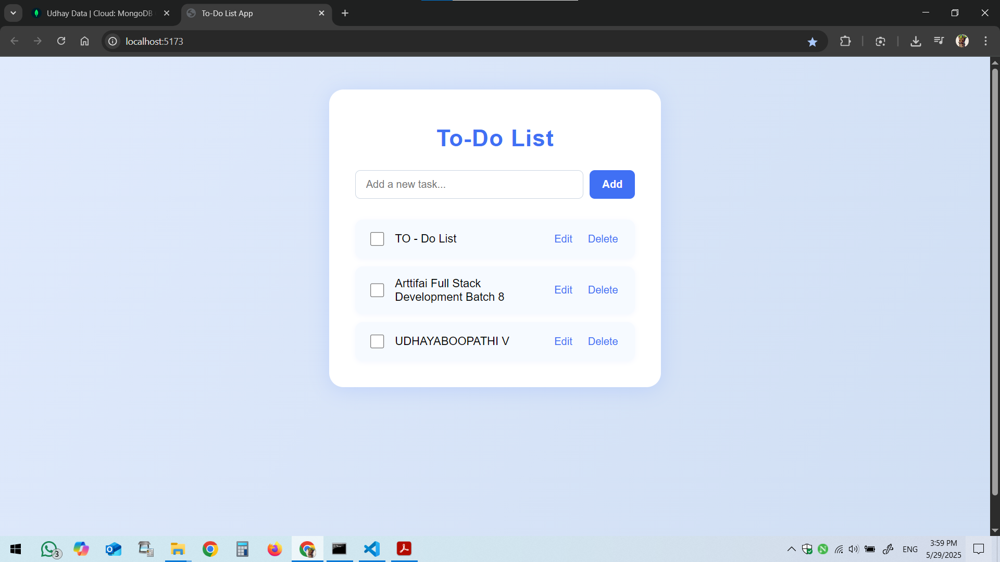
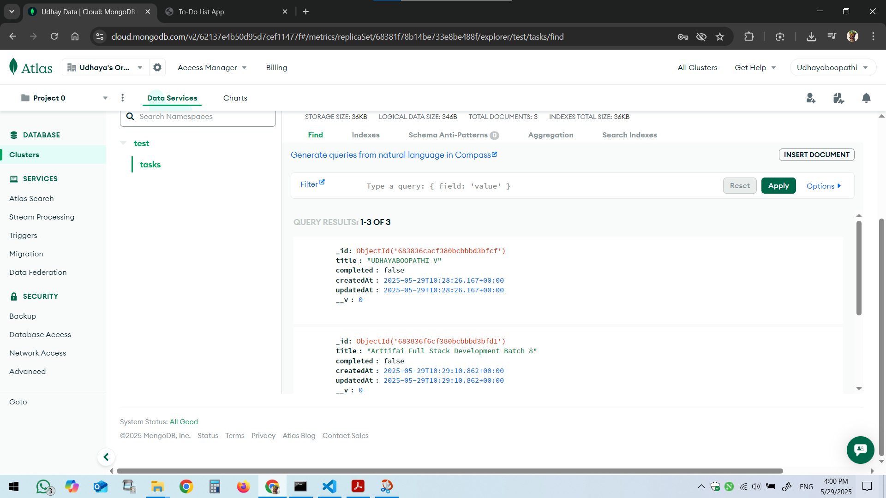

# To-Do List Full Stack Application

A modern, full-stack To-Do List web application built as an internship project.  
This app allows users to create, read, update, and delete tasks with a responsive UI and persistent storage.

---

## 🗂️ Project Structure

```
Task/
  backend/    # Express.js + MongoDB API
  frontend/   # React.js + Vite + Tailwind CSS UI
```

---

## 🚀 Features

- Add, edit, complete, and delete tasks
- Responsive, modern UI (Tailwind CSS + custom styles)
- RESTful API with Express.js and MongoDB (Mongoose)
- Error handling and validation
- Modular, maintainable codebase

---

## 🛠️ Tech Stack

- **Frontend:** React.js, Vite, Tailwind CSS, Axios
- **Backend:** Express.js, MongoDB (Mongoose), CORS, dotenv, morgan
- **Other:** Node.js, npm

---

## ⚡ Quick Start

### 1. Clone the Repository

```sh
git clone https://github.com/Udhayaboopathi/Fullstack_Web_Development-_Arttifai_Tech_batch_8.git
cd Task
```

---

### 2. Backend Setup

```sh
cd backend
npm install
```

- Create a `.env` file in `backend/` with:
  ```
  PORT=5000
  MONGO_URI=<your-mongodb-uri>
  ```
- Start the backend server:
  ```sh
  npm run dev
  ```
  The API runs at [http://localhost:5000/api/tasks](http://localhost:5000/api/tasks)

---

### 3. Frontend Setup

```sh
cd ../frontend
npm install
```

- (Optional) To use a custom backend URL, create a `.env` file:
  ```
  VITE_API_URL=http://localhost:5000/api/tasks
  ```
- Start the frontend:
  ```sh
  npm run dev
  ```
  The app runs at [http://localhost:5173](http://localhost:5173)

---

## 📝 API Endpoints

- `GET    /api/tasks` – List all tasks
- `POST   /api/tasks` – Create a new task
- `GET    /api/tasks/:id` – Get a single task
- `PUT    /api/tasks/:id` – Update a task
- `DELETE /api/tasks/:id` – Delete a task

---

## 📁 Folder Highlights

- **backend/**

  - `server.js` – Express app entry point
  - `models/Task.js` – Mongoose schema
  - `controllers/` – Route logic
  - `routes/` – API routes
  - `middlewares/` – Error handling

- **frontend/**
  - `src/`
    - `App.jsx`, `main.jsx` – App entry
    - `pages/`, `components/` – UI logic
    - `api/tasks.js` – API calls
    - `index.css`, `App.css` – Styling

---

## 🖥️ Screenshots




---

## 🙋‍♂️ Author

- **Name:** UDHAYABOOPATHI V
- **Internship:** Arttifai Tech
- **Date:** May 2025

---

## 📌 Notes

- Make sure MongoDB is running and accessible.
- For production, build the frontend with `npm run build` and deploy both apps as needed.

---

## 📃 License

This project is for educational and internship purposes.
